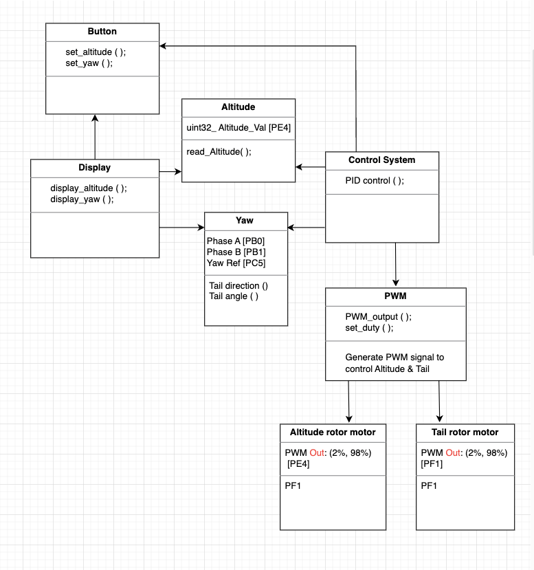

# TO-DO LIST

- [x] Optimize the circular buffer
- [x] Finish the INT

# Criteria (Total 25 marks)

## FreeRTOS:

### Tasks  (3 marks)

- [x] Justification for Task definitions and task priorities  

### Resources (6 marks)
Demonstrate effective use of 
- [x] queues,
- [x] semaphores,
- [x] mutexes: Altitude & Yaw Values

e.g., protecting the serial port or OLED tasks to correctly show height and/ or yaw for debugging

## Performance

### Take-Off (3 marks)
- [x] Ability to "take of",achieve 50% Alt & maintain Alt.

### Responsiveness (3 marks)
- [x] FreeRTOS ISR operation/response
- [x] Use for Phase A & B 

### Stability (3 marks)
- [x] Stability of "flight" under  adverse "flying" conditions
- [x] TEST: use hand push the helicopter, check it will be back target height ?

## Measurement:
### Testing (3 marks)
- [x] Accuracy of Yaw OR Height as measured/tested

### Signals via scope (3 marks)
- [x] Show the most appropriate signals changing on a scope.

### Blackbox test (3 marks)
- [x] Describe a black-box test in terms a set of equivalence classes, and demonstrate one class test for pass/fail.

### Run Code
"#include \<stdbool.h>" must be added to the start of timer.h in order for the code base to compile. 
